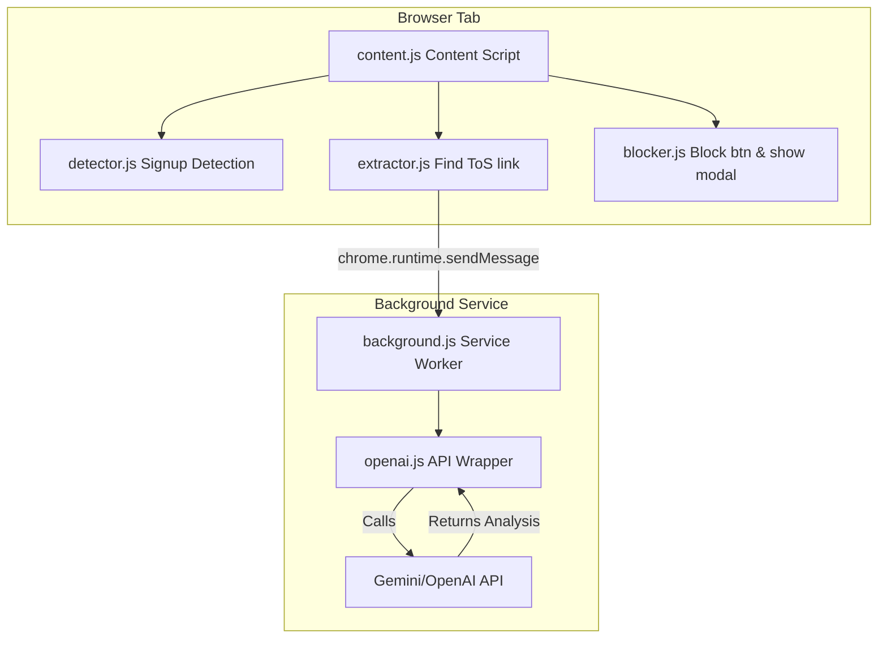

<h1 align="center">BLINDSIGHT</h1>

<p align="center">
  <strong>Your Legal Firewall — Because nobody reads the fine print.</strong>
</p>

<p align="center">
  <br>
  <em><strong>Standard Result:</strong> Extension showing a green signal for safe terms</em><br><br>
  
  <br>
  <em><strong>Cautionary Result:</strong> Extension showing an orange signal for notable risks</em><br><br>
  
  <br>
  <em><strong>Critical Result:</strong> Extension showing a red signal for predatory clauses</em><br><br>
  
  <br>
  <em><strong>Settings:</strong> Easy configuration of your OpenAI or Gemini API keys</em>
</p>

<p align="center">
  A Chrome extension that scans Terms of Service for harmful clauses<br>
  and protects you <em>before</em> you click Accept.
</p>

---

## What It Does

**Blind-Sight** automatically detects signup pages, extracts Terms of Service text, and uses AI to identify potentially harmful legal clauses — all in real-time. When dangerous terms are found, it blocks the "Accept" button and shows you exactly what you're agreeing to.

### Detects These Clause Types

| Type | What It Means |
|------|---------------|
| **Data Selling/Sharing** | Your data may be sold to third parties |
| **Forced Arbitration** | You waive right to sue in court |
| **No Class Action** | No group lawsuits allowed |
| **Unilateral Changes** | Terms can change without notice |
| **Content Rights** | They may own your content |
| **Liability Waiver** | Limited accountability for damages |

---

## Features

- **AI-Powered Analysis** — Uses Gemini Flash or OpenAI GPT to understand legal language
- **4-Tier Severity System** — Standard → Notable → Cautionary → Critical
- **Friction-Based Blocking** — Can't accidentally accept dangerous terms
- **Scan History** — Track what you've analyzed across sites
- **Privacy Alternatives** — Suggests better alternatives for risky services
- **Works Everywhere** — Automatic detection on any signup page
- **Your Keys, Your Privacy** — Bring your own API key (no data stored externally)

---

## Quick Start

### 1. Installation

```bash
# Clone the repository
git clone https://github.com/ssudhiravinesh/BLINDSIGHT-SYNDICATE.git

# Navigate to chrome://extensions in Chrome
# Enable "Developer mode" (toggle in top-right)
# Click "Load unpacked"
# Select the 'blind-sight' folder
```

### 2. Add Your API Key

1. Click the **Blind-Sight** icon in your toolbar.
2. Go to **Settings**.
3. Enter your **Gemini API key** or **OpenAI API key**.
4. Click **Save**.

> **Note:** Get a free Gemini API key at [aistudio.google.com](https://aistudio.google.com/app/apikey).

### 3. Start Browsing

Visit any signup page — Blind-Sight will automatically scan the Terms of Service and alert you to concerning clauses.

---

## Project Structure

```
blind-sight/
├── manifest.json           # Extension config (Manifest V3)
├── popup/                  # Extension popup UI
│   ├── popup.html
│   ├── popup.css
│   └── popup.js
├── options/                # Settings page
│   ├── options.html
│   ├── options.css
│   └── options.js
├── content/                # Content scripts
│   ├── content.js          # Main orchestrator
│   ├── detector.js         # Signup page detection
│   ├── extractor.js        # ToS link finder & scraper
│   └── blocker.js          # Button blocking & modal
├── background/
│   └── background.js       # Service worker (API calls)
├── lib/
│   ├── openai.js           # AI API wrapper
│   └── alternatives.js     # Privacy alternatives DB
├── styles/
│   └── warning-modal.css   # Warning modal styles
└── assets/                 # Extension icons
```

---

## Technical Architecture



*(Diagram represents the data flow between content scripts and the background service worker)*

---

## Development

### Prerequisites

- Chrome browser
- [Gemini API key](https://aistudio.google.com/app/apikey) or [OpenAI API key](https://platform.openai.com/api-keys)

### Local Development

1. Make changes to the source files.
2. Go to `chrome://extensions`.
3. Click the refresh icon on the Blind-Sight card.
4. Test your changes.

### Testing

Test on these sites to verify functionality:
- `accounts.google.com/signup`
- `github.com/signup`
- `twitter.com/i/flow/signup`

---

## Roadmap

- [ ] Support for inline ToS (modals, iframes)
- [ ] More clause types (auto-renewal, perpetual licenses)
- [ ] User whitelist/blacklist
- [ ] Severity scoring (1-10 risk scale)
- [ ] Browser compatibility (Firefox, Edge)
- [ ] Optional backend proxy for API keys

---

## Contributing

Contributions are welcome! Please feel free to submit a Pull Request.

1. Fork the repository.
2. Create your feature branch (`git checkout -b feature/AmazingFeature`).
3. Commit your changes (`git commit -m 'Add some AmazingFeature'`).
4. Push to the branch (`git push origin feature/AmazingFeature`).
5. Open a Pull Request.

---

## License

This project is licensed under the MIT License — see the [LICENSE](LICENSE) file for details.

---

<p align="center">
  <strong>Because you deserve to know what you're agreeing to.</strong><br>
  <sub>Made with ❤️ by the SYNDICATE Team</sub>
</p>